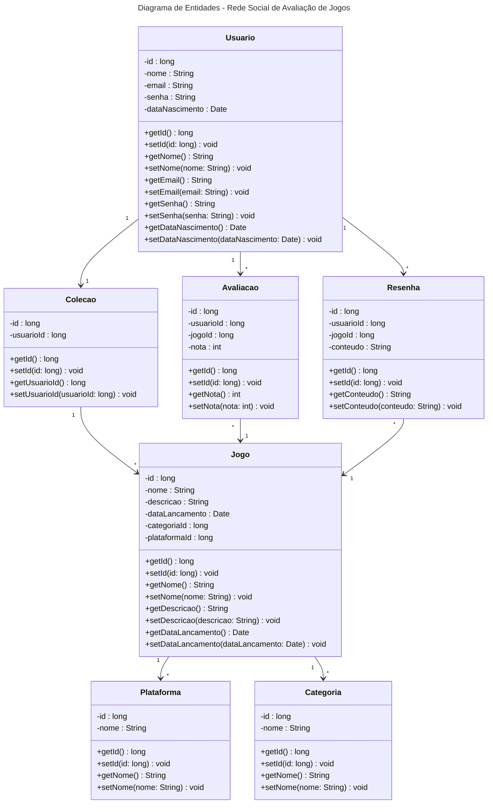

# Fábrica de Software 2025/2
Clara Meister Martinovsky e Guilherme Torres Fiedler.

## Proposta de projeto 
- Rede Social de avaliação de jogos: 
	- cadastro e organização da coleção; 
	- avaliações;
 	- resenhas; 
	
<s>
- Aplicativo de Diário criativo: 
	- criação e edição de entrada multimídia(áudio, imagens, desenhos); 
	- Organização visual com temas; 
	- Notificações e lembretes; 
</s>

## Aula 05/08
- JRE - Java Runtime Enviroment
	- Ambiente mínimo para executar um programa Java
	- JVM - Java Virtual Machine (java.exe ou javaw.exe)

- JDK - Java development Kit
	- Ambiente de DESENVOLVIMENTO (javac.exe) compilador

- Compilação
	1) Escreve um programa em java (arquivo.java)
	2) Compilação arquivo.java -> javac.exe -> bytecode ou arquivo.class
- Execução
	3) Passar .class -> java.exe (JVM) -> linguagem máquina

## Histórias de Usuários
Organização da Coleção

Como usuário, eu gostaria de selecionar jogos na plataforma para organizar minha coleção pessoal.
Como usuário, eu gostaria de visualizar informações detalhadas sobre cada jogo, como descrição, avaliações e imagens, para tomar decisões informadas.
Como usuário, eu gostaria de explorar listas de jogos populares, mais esperados ou lançamentos futuros para descobrir novos títulos.

Status de Jogo

Como usuário, eu gostaria de marcar o status de cada jogo (ex: "Jogado", "Em andamento", "Não jogado") para acompanhar meu progresso.
Como usuário, eu gostaria de filtrar minha coleção por status para visualizar rapidamente os jogos em diferentes estágios.

Avaliações e Resenhas

Como usuário, eu gostaria de avaliar os jogos que joguei para compartilhar minha opinião com a comunidade.
Como usuário, eu gostaria de escrever resenhas detalhadas sobre os jogos para fornecer informações úteis a outros jogadores.
Como usuário, eu gostaria de editar ou excluir minhas avaliações e resenhas para corrigir ou atualizar informações.

Pesquisa por Jogos

Como usuário, eu gostaria de pesquisar por jogos na plataforma para descobrir novos títulos.
Como usuário, eu gostaria de filtrar os resultados da pesquisa por categoria, plataforma ou avaliação para encontrar jogos que atendam aos meus interesses.

Integração com APIs de Dados de Jogos

Como desenvolvedor, eu gostaria de integrar a plataforma com APIs externas para obter dados atualizados sobre jogos, como informações de lançamento e atualizações.

## Aula 19/08
## Diagrama de entidades

